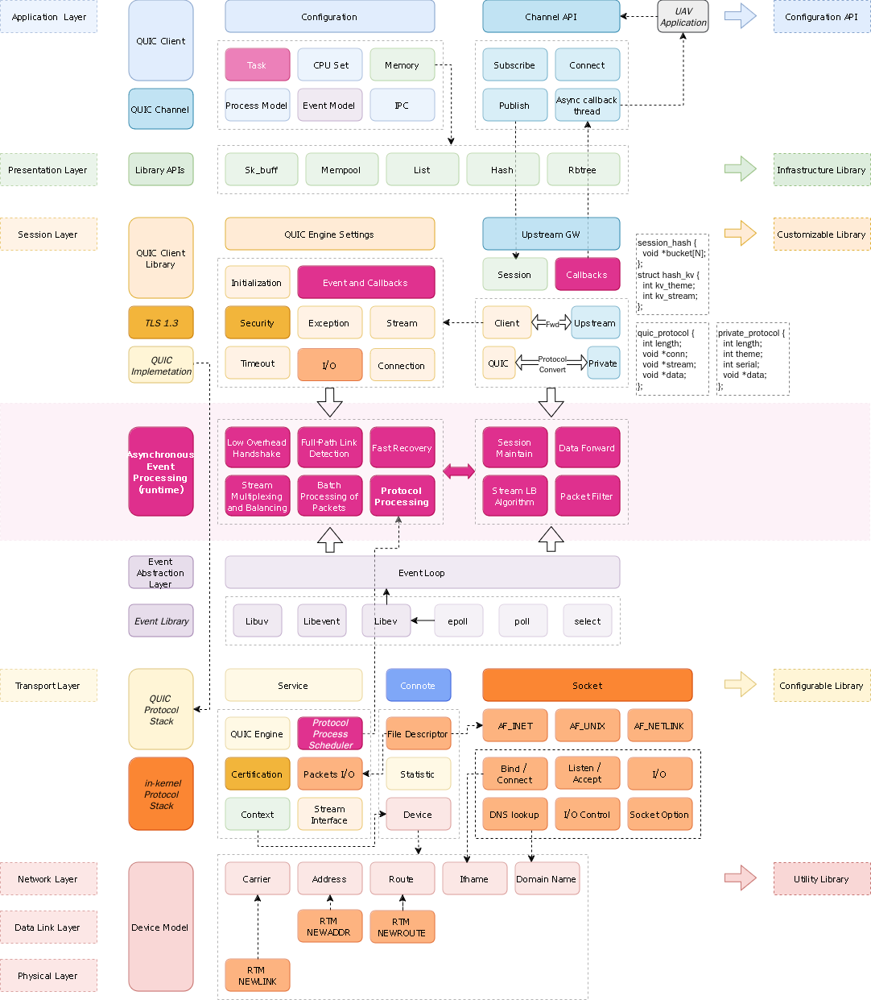
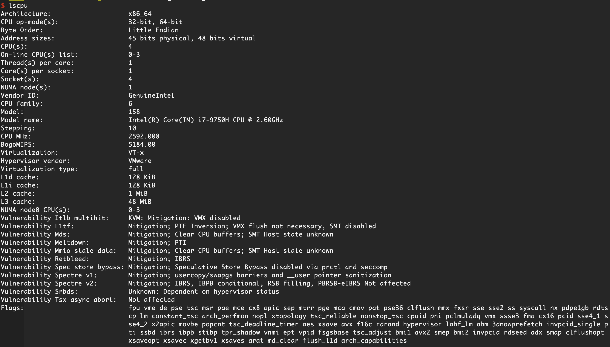
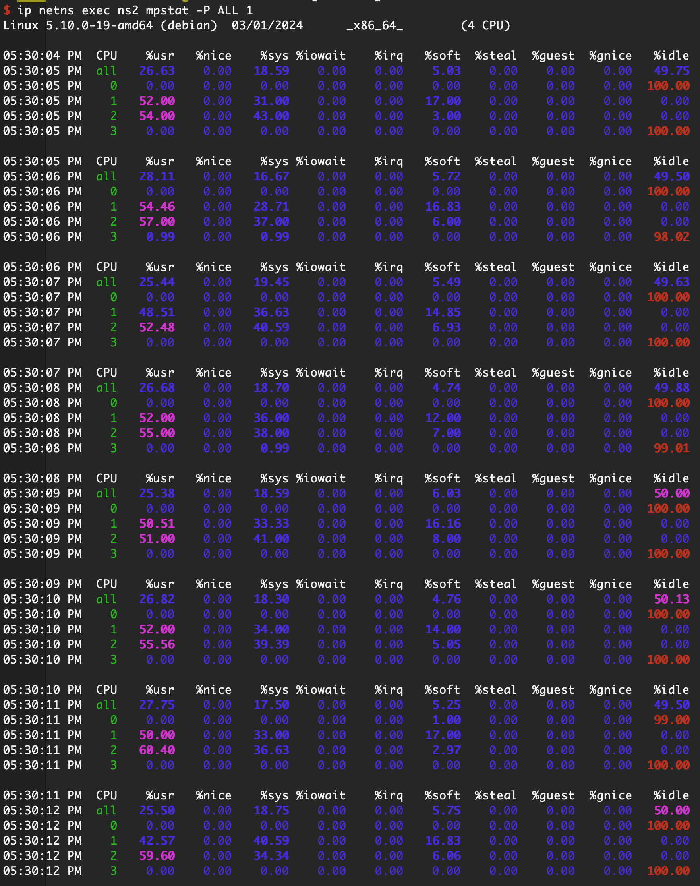
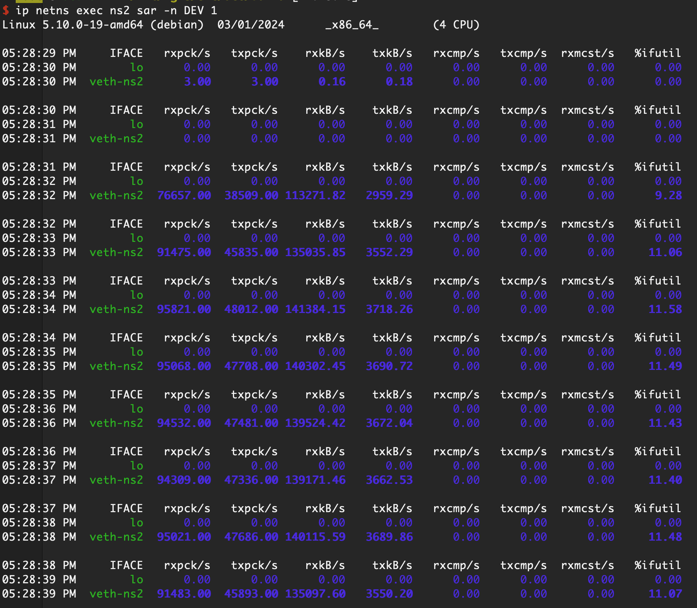

## About ACE
Ace is a quic based client/server framework. It possesses the following features:
1. A layered design shields the details of the QUIC protocol stack implementation and most of the event library calls.
2. Optimized network and disk I/O to enhance the performance of the QUIC protocol stack.
3. Highly customizable upper-layer service interfaces.
4. Other easy-to-use debugging modules, feature libraries, and scripts.

The overall transmission performance approaches gigabit line speed (or even higher).

## Architecture


## Requirements
lsquic v3.x, libev and libmagic.

Check directory **lib/** and **include/** first before you build them.

## Compiling
```
git clone https://github.com/erocpil/ace.git
cd ace && mkdir build && cd build
cmake ..
make auth
make -j
```

## Run
1. start server:
   ```
   src/ace 1
   ```
3. start client:
   ```
   src/ace 0
   ```
5. telnet client to perform some tasks:
   ```
   telnet 127.0.0.1 9999
   ```
   a. for sending file task (with 3 streams, not including stream(0)):
   ```
   sf 3 tmp/100m.dat
   ```
   b. for performance task:
   ```
   perf 1 1
   ```

## Performance
1. CPU Model
   
2. CPU Usage
   
3. Mpstat
   
4. Sar
   

## Platforms
Ace can run on x86_64 and aarch64.

## TODO
1. Bidirectional data flow support.
2. More comprehensive upstream GW.
3. Any feed back is appreciated.

