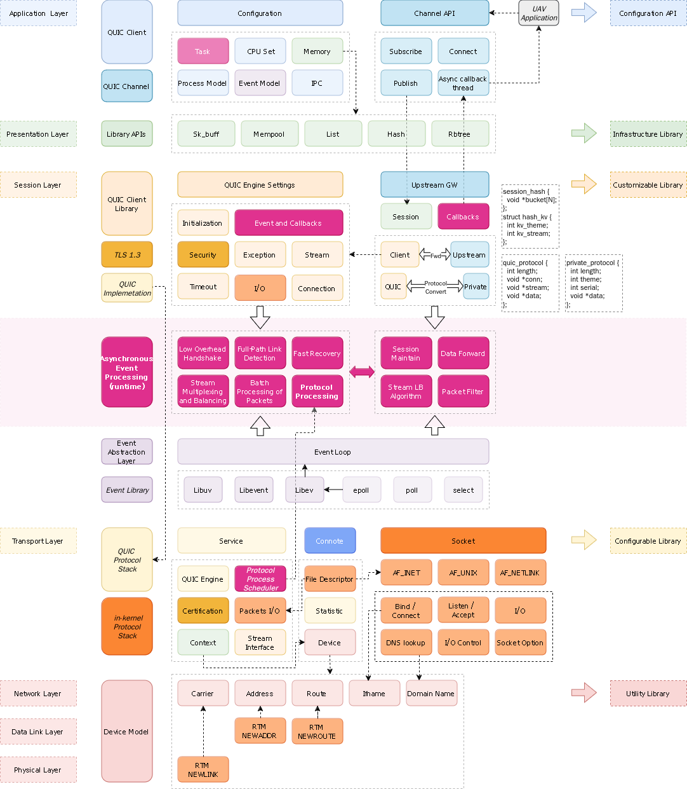

[](https://github.com/erocpil/ace/actions/workflows/ci.yml)

# ACE

ACE is an experimental QUIC client/server framework written in C. It uses
[lsquic](https://github.com/litespeedtech/lsquic) for QUIC,
[BoringSSL](https://boringssl.googlesource.com/boringssl) for TLS, and
[libev](https://software.schmorp.de/pkg/libev.html) for event processing.

The current implementation provides:

- automatic client-to-server QUIC connection establishment;
- TLS handshake and session resumption;
- bidirectional control streams and concurrent data streams;
- multi-stream file transfer with bounded frame, queue, stream, and file sizes;
- IPv4 and IPv6 socket, packet-info, ECN, and address handling;
- partial-I/O, retry, backpressure, and UDP zerocopy fallback handling;
- signal-driven shutdown with joined service threads;
- process-wide, thread-safe lsquic initialization;
- unit, sanitizer, fuzz, and real localhost QUIC regression tests.

ACE is still a research-oriented project. See the
[engineering roadmap](docs/engineering-roadmap.md) for current limitations and
the prioritized work queue.

## Architecture



The service layer owns a QUIC engine and event loop. Connection and stream
callbacks translate QUIC events into framed tasks, while the upstream Unix
socket accepts local control requests such as multi-stream file transfers.

## Supported platforms

- x86_64 Linux: built and tested continuously.
- AArch64 Linux: dependency and link paths are present, but continuous ARM64
  validation is not yet available.

## Dependencies

The dependency bootstrap pins the versions expected by the vendored headers:

| Dependency | Version |
|---|---|
| lsquic | v3.3.1, pinned commit |
| BoringSSL | API version 18, pinned commit |
| libev | v4.33, SHA-256 verified archive |

On Ubuntu, install the build and test prerequisites with:

```bash
sudo apt-get update
sudo apt-get install -y \
  build-essential clang cmake curl git golang-go iproute2 \
  liblzma-dev libmagic-dev openssl perl socat zlib1g-dev
```

CMake 3.16 or newer is required.

## Build

Build the pinned static dependencies first. Products are written to
`lib/x86_64/` or `lib/aarch64/` according to the host architecture.

```bash
bash scripts/build-deps.sh
```

GitHub is the default source. Select the configured Gitee mirrors explicitly
when needed:

```bash
MIRROR=gitee bash scripts/build-deps.sh
```

Then configure and build ACE using a preset:

```bash
cmake --preset debug
cmake --build --preset debug
```

The main products are:

- `build/debug/src/ace` — QUIC client/server executable;
- `build/debug/src/alpha` — upstream/debug helper.

Available configure/build presets are `debug`, `release`, `asan`, `ubsan`,
`lsan`, and `fuzz`.

Build-time development certificates are generated inside the selected build
directory. No test private keys are stored in the repository.

## Test

Run the focused unit and source-contract regression suite with:

```bash
ctest --preset debug
```

The suite currently covers buffer boundaries, task/frame validation, retry and
partial-I/O behavior, UDP send fallback, IPv4/IPv6 address helpers, concurrent
global QUIC initialization, lifecycle and ownership contracts, dependency
pins, ephemeral certificates, observability, and test harness safety.

### Real QUIC integration test

The smoke test starts a server and client, verifies a real TLS/QUIC handshake,
echoes a checksummed 4096-byte probe, transfers a 98,304-byte random file over
three streams, compares the persisted file byte-for-byte, and verifies clean
thread shutdown.

```bash
ACE_BUILD_DIR=build/debug bash scripts/smoke-test.sh
ACE_BUILD_DIR=build/debug ACE_IP_VERSION=6 bash scripts/smoke-test.sh
```

The first command uses IPv4; the second uses IPv6.

### Sanitizers and fuzzing

```bash
cmake --preset asan
cmake --build --preset asan
ctest --preset asan

cmake --preset ubsan
cmake --build --preset ubsan
ctest --preset ubsan

cmake --preset fuzz
cmake --build --preset fuzz
build/fuzz/tests/fuzz_task_protocol -runs=10000
```

LeakSanitizer also has a dedicated `lsan` preset. Its runtime requires an
environment that permits LeakSanitizer process inspection.

## Run manually

Start the server in one terminal:

```bash
./build/debug/src/ace 1
```

Start the automatically connecting client in another terminal:

```bash
./build/debug/src/ace 0
```

By default, the server listens on UDP port 12345 and the client exposes its
local control interface at `/var/run/client`. A writable alternative can be
selected for unprivileged use:

```bash
ACE_UPSTREAM_FILE=/tmp/ace-client.sock ./build/debug/src/ace 0
printf 'sf 3 /path/to/input.bin\n' | \
  socat - UNIX-CONNECT:/tmp/ace-client.sock
```

Received files are confined to the `received/` directory.

### Runtime environment variables

| Variable | Purpose | Default |
|---|---|---|
| `ACE_IP_VERSION` | Select `4` or `6` for the built-in endpoints | `4` |
| `ACE_UPSTREAM_FILE` | Client control Unix socket path | `/var/run/client` |
| `ACE_CERT_FILE` | Override TLS certificate path | generated build certificate |
| `ACE_KEY_FILE` | Override TLS private-key path | generated build key |
| `ACE_BUILD_DIR` | Build directory used by test scripts | `build` |
| `MIRROR` | Dependency source selection (`github` or `gitee`) | `github` |

## Project layout

```text
ace/
├── .github/workflows/ci.yml   # GCC/Clang, sanitizer, fuzz, IPv4/IPv6 CI
├── CMakePresets.json          # Debug, Release, sanitizer, and fuzz presets
├── docs/                      # Engineering roadmap
├── include/                   # Version-matched dependency headers
├── lib/                       # Architecture-specific static dependencies
├── scripts/
│   ├── build-deps.sh          # Reproducible dependency bootstrap
│   ├── smoke-test.sh          # Real QUIC transfer regression
│   └── fault-injection-test.sh
├── src/                       # Client, server, service, task, and I/O code
└── tests/                     # Unit, contract, concurrency, and fuzz tests
```

## Continuous integration

GitHub Actions verifies:

- GCC and Clang Debug/Release builds;
- all registered CTest regressions;
- AddressSanitizer and UndefinedBehaviorSanitizer;
- a bounded 10,000-run protocol fuzz campaign;
- real IPv4 and IPv6 QUIC handshakes and multi-stream transfers.

## License

ACE is available under the [MIT License](LICENSE).
